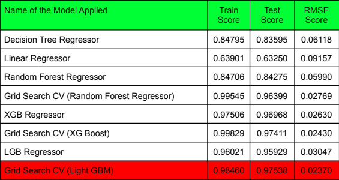
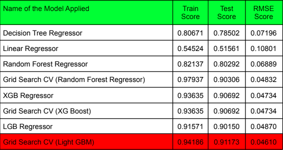
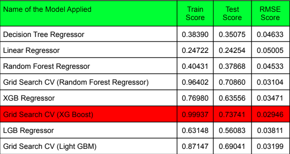
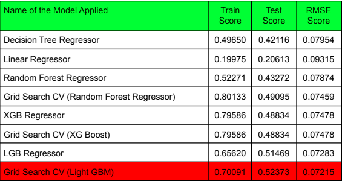

# Traffic Prediction

## Problem Statement

Traffic prediction means forecasting the volume and
density of traffic flow, generally for the purpose of managing vehicle movement, reducing congestion, and generating the optimal (least time or energy-consuming) route. The task of detecting traffic for the next day, week etc.

## Dataset

The dataset contains 4 components (DateTime, Junction, Vehicles, id)
across 48120 rows. The DateTime column shows the timestamp along with the respective date.

- **DateTime** - It shows the date and timestamp
- **Junction** - It tells the junction number for which vehicles are present
- **Vehicles** - It tells the number of vehicles
- **id** - It tells the id number of a timestamp

Link to the dataset: [traffic.csv](https://github.com/ayushabrol13/Traffic-Prediction---PRML-Course-Project/blob/master/traffic.csv)

## Implemented the following algorithms

- **Decision Tree Regressor**
  Decision tree builds regression or classification models in
  the form of a tree structure. It breaks down a dataset into smaller and smaller subsets
  while at the same time an associated decision tree is incrementally developed. The final
  result is a tree with decision nodes and leaf nodes.
## Machine Learning Models Used

- **Linear Regression**
  A linear approach to modeling the relationship between a dependent variable and one or more independent variables. Used as a baseline model for traffic prediction.
- **Decision Tree Regressor**
  A tree-based model that uses a decision tree to go from observations about an item to conclusions about the item's target value. Effective for capturing non-linear relationships in traffic data.
- **XGBoost Regressor**
  Extreme Gradient Boosting, or XGBoost for short, is an efficient ensemble learning algorithm via gradient boosting. It provides a parallel implementation of decision trees that are created in a sequential form, where weights play an important role.
- **GridSearchCV for Hyperparameter Tuning**
  For tuning the hyperparameters, We have used Grid Search CV, which uses a different combination of all the specified hyperparameters and their values and calculates the performance for each combination and selects the best value for the hyperparameters.

## Traffic Flow across different junctions according to time-period

## Correlation Heatmap

## Yearwise Count

## Traffic Flow Pairplots

## Model Evaluation

- **Junction 1**
  

- **Junction 2**
  

- **Junction 3**
  

- **Junction 4**
  

## Web Application and Pipeline Deployment

We implemented an end-to-end pipeline using the python pickle library. The four best models
for four different junctions were saved along with the preprocessing done on the data using the
pickle library and the four “.pkl” model files were created.

Then, we converted our directory into a pipenv environment and installed all the necessary
libraries.
We created a python file where we used the Python StreamLit library to render our website
server which included a home page (predictions page) which takes the input features from the
user in the form of radio buttons. 
Features that were input by the user:

- Year
- Month
- Date
- Hour
- Junction

We import all the four saved models in our py file and select which model to apply according to
the Junction information provided by the user and finally return the rounded off predictions
(Number of Vehicles) to the user.
## Contributors

[Ayush Abrol](https://github.com/ayushabrol13)

[Aryan Tiwari](https://github.com/AryanTiwarii)

[Neehal Prakash Bajaj ]()
